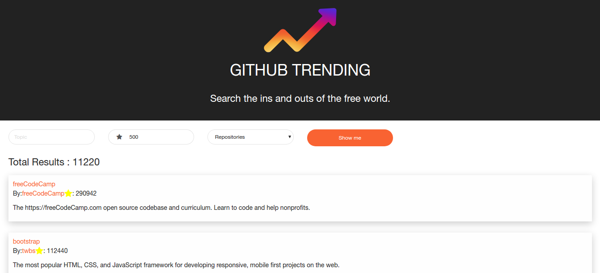

## Github Trending
_____
https://ghtrends.herokuapp.com/

This project will allow you to access the github developer search api.
You can search repositories and users based on their forks, stars or followers.

Implemented using `create-react-app` and `https://developer.github.com/v3/search`.

To setup,
- run `npm install`
- run `npm start`
- open `http://localhost:3000/`

Screenshot :

